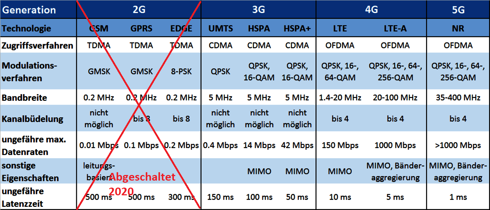
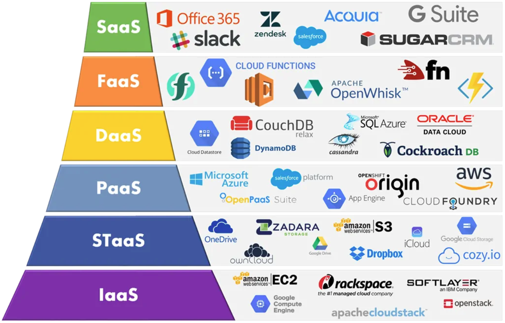

# M216

<h2>IoE - Das Netz von Allem</h2>

* IoE Säulen = People, Process, Date, IoT

* People =  Leute auf eine wertvollere Weise vernetzen.

* Process = liefert die richtigen Daten zur richtigen Zeit an den richtigen Ort.

* Data = Daten verwenden um noch bessere Entscheidungen zu treffen.

* IoT = Objekte wie Handys usw. mit einander vernetzen um noch klügere Entscheidungen zu treffen.

* Big Data = Unter "Big Data" versteht man die unendliche Fülle von Informationen welche im Internet durch die wachsende Anzahl verbundener Geräte generiert werden.

<h2>IoT - Das Netz der Dinge</h2>

* Physische Objekte, die verbunden werden sollen: Ob Druckmaschinen, Paletten, Pakete oder Strassenlaternen: Es gibt viele Dinge, über die es sich mehr zu wissen lohnt, die wir vielleicht sogar aktiv steuern wollen. Was wir aus dem IoT machen hängt nicht zuletzt davon ab, wie kreativ wir sind.

* Konnektivität: Kein Internet ohne Verbindung. Im Falle des IoT gibt es viele Wege, die ans Ziel führen. Dafür kommt es auf stromsparende Modems an den Geräten selbst, aber auch auf die richtige zugrundeliegende Funktechnologie an.

* Sensorik: Damit es etwas gibt, worüber die Dinge funken können, ist die richtige Sensorik der Schlüssel: Vom Thermometer über Beschleunigungssensoren hin zu GPS-Trackern, das IoT kann seine Umgebung auf viele Weisen erfassen. Und auch Aussagen über sich selbst treffen, etwa bei der Verschleissbestimmung.

* Infrastruktur: Das IoT funkt nicht zum Selbstzweck. Erst mit einer Daten-Infrastruktur, die die Daten verknüpft und daraus Erkenntnisse zieht, wird der Datenschatz auch gehoben.

<H2>IIoT (Industrial Internet of Things)</h2>

* Das IIoT (Industrielle Internet der Dinge) ist eine Unterkategorie des IoT. Der Begriff bezeichnet IoT-Technologien, die in der industriellen Umgebung verwendet werden, insbesondere in Fertigungseinrichtungen.

* Das IIoT bietet viele derselben Vorteile wie das IoT. Sie können intelligente Sensoren in Fertigungsmaschinen, Energiesysteme und Infrastruktur wie Rohr- und Kabelleitungen integrieren. Mit den gesammelten Daten können Industrieunternehmen unter anderem ihre Effizienz, Produktivität, Mitarbeitersicherheit erhöhen.

<h2>KI</h2>

* Künstliche Intelligenz (KI) hingegen ist bei solchen Aufgaben im Allgemeinen sehr erfolgreich.

* Sie kann beispielsweise selbstständig Muster in den Messwerten aus der Produktion erkennen und so den Fertigungsprozess immer weiter verbessern. Künstliche Intelligenz trägt so wesentlich dazu bei, dass das IoT so erfolgreich ist.

* OpenAI LP ist ein US-amerikanisches Unternehmen, das sich mit der Erforschung von künstlicher Intelligenz (KI, englisch Artificial Intelligence, AI) beschäftigt.

<h2>IoE vs IoT</h2>

* Während das IoT einen einheitlichen technologischen Übergang bildet, umfasst das IoE verschiedene Technologien, einschliesslich der IoT-Technologie und diverser Kommunikationsverbindungen.

* Der klassische Ansatz der Host-basierten Kommunikation wird beim IoE durch die inhaltsbasierte Kommunikation abgelöst. Bei dieser Netzarchitektur geht es um den qualifizierten Informationsgehalt, um dessen Kennzeichnung, Weiterleitung und Speicherung.

<h2>Industrie 4.0</h2>

* Angetrieben durch das Aufkommen neuer Technologien, bezieht sich die Industrie 4.0 auf eine neue Generation von vernetzten, robotergestützten und intelligenten Unternehmen.

* Mit der digitalen Revolution verschwimmen die Grenzen zwischen der physischen und der digitalen Welt. Dadurch werden vernetzten 4.0-Betrieben neues Leben eingehaucht, in welchem Menschen, Maschinen und Produkte miteinander interagieren.

<h2>Cloud- und Edge Computing</h2>

<h3>Cloud Computing heisst:</h3>

* Die Datenverarbeitung findet in einer Cloud statt – also auf Speicherplatz und Prozessoren, die typischerweise von einem Rechenzentrum angeboten werden, das irgendwo auf der Welt liegen kann.

* Cloud Computing ist ideal, um große Datenmengen zu speichern und zu verarbeiten, etwa um KI-Modelle zu trainieren.

* Die Cloud ist über das Internet mit den Datenquellen im Feld verbunden.

<h3>Edge Computing heisst:</h3>

* wenn die Felddaten nicht direkt in die Cloud übertragen werden, sondern wenn sogenannten Edge Devices, die physikalisch dicht bei den Datenerzeugern liegen, diese Rohdaten aufbereiten (z.B. analysieren) und nur die relevanten Ergebnisse an die Cloud übermitteln.

* Der Ansatz spart teure Datenübertragung zur Cloud, ermöglicht Echtzeitdienste und führt zu mehr Datensicherheit und Zuverlässigkeit.

* Für Edge Computing eignen sich ausgewählte Industrie PCs oder auch andere Geräte mit freien Kapazitäten wie Netzwerk-Switches, Controller oder Feldgeräte.

<h2>Protokolle</h2>

* Analoge Signale sind fliessend. Die Spannung wird kontinuierlich verändert.

* Beispiele: Audiosignal zu einem Lautsprecher, Temperaturfühler, Dimmer, Herzrythmus an einem EGK, Rampe für Rollstuhlfahrer

* Digitale Signale sind stufenweise oder Binär. Dies Spannung wird stufenwiese verändert oder als Binär-Signal ein- beziehungsweise ausgeschaltet.

* Beispiele: Ethernet per Kabel, Lichtschalter, Digitalthermometer, Treppe

<h3>Anmerkung zu Digitalen Übertragung</h3>

* Simplex Daten: werden nur in eine Richtung übertragen

* Duplex Daten: werden in beide Richtungen übertragen

* Half-Duplex: Zeitgleich nur in eine Richtung

* Full-Duplex: Zeitgleich in beide Richtungen

* Asynchron: Die Daten werden nach Belieben übertragen.

* Synchron: Die Daten werden nach einem bestimmten Takt (Uhr) übertragen

* Parallel: Daten werden gleichzeitig auf mehreren Drähten übermittelt.

* Seriell: Daten werden auf einem Draht hintereinander gesendet

* Master: Hauptgerät, welches in einem Verbund die Priorität hat oder die Steuerung  übernimmt.

* Slave: In der Regel ohne Master nicht nutzbar.

<h2>I²C - Inter-Integrated Circuit</h2>

* Der I²C-Bus ist als Zweidrahtverbindung zwischen einem Master (Controller) und an ihn angeschlossene Sensoren oder IC-Bausteine (Slaves) für kurze Distanzen konzipiert worden.

* Nur der Master steuert die Verbindung zwischen ihm und den Slaves.

* An einer Kommunikation können auch mehrere Master und bis zu 128 Slaves beteiligt sein. 

* Die beiden dazu notwendigen Datenleitungen, neben den Versorgungsspannungsleitungen, bezeichnen wir mit SDA (Datenleitung) und SCL (Taktleitung).

* SDA und SCL bilden den Datenbus.

* SDA: Serial DAta Line: (serielle Datenleitung)

* SCL: Serial CLock Line (serielle Taktleitung)

<h2>MQTT</h2>

* MQTT (Message Queue Telemetry Transport) ist ein schlankes Protokoll für die Kommunikation zwischen verschiedenen Geräten (M2M – machine-to-machine).

* Das MQTT Protokoll benötigt einen Datenbroker. Dieses ist die zentrale Idee dieser Technologie. 

* Alle Geräte senden ihre Daten zu diesem Broker und erhalten ihre Informationen auch nur von ihm.

* MQTT verwendet den Port 1883 und 8883 (LTS-Protokoll-Verschlüsselt).

<h2>Funktechnologien und deren Einsatzgebiet</h2>

* IoT-Sensoren nutzen Funktechnologien, um Kosten- und Zeitaufwand für Verkabelung zu sparen.

* Die Sensoren übertragen kleine Datenpakete über eine Batterie.

* Die Funktechnologie muss geringen Energieverbrauch, hohe Reichweite und starke Durchdringung von Objekten aufweisen.

* Im Consumer-Bereich werden meist Short Range Devices (WLAN, Bluetooth, ZigBee) verwendet.

* Für industrielle IoT-Lösungen wird oft klassischer Mobilfunk genutzt, aber LPWAN-Funktechnologien bieten bessere Eigenschaften wie geringere Kosten, geringen Energieverbrauch und gute Durchdringung.

* LoRaWAN, Sigfox und NB-IoT sind bekannte LPWAN-Technologien mit unterschiedlichen Eigenschaften.

<h3>Bluetooth</h3>

Bluetooth ist ein Funkstandard zur Übertragung von Daten, Musik, Videos und Bildern auf kurzen Distanzen.

* Es ermöglicht die Kommunikation zwischen gekoppelten Geräten ohne Kabelverbindung.

* Die Bluetooth Special Interest Group (SIG) hat den Standard Ende 1990er entwickelt und hat heute mehr als 30.000 Unternehmen als Mitglieder.

* Bluetooth nutzt das ISM-Band und verfügt über Frequenz-Hopping, um Störungen zu vermeiden und die Störsicherheit zu erhöhen.

* Seit der Einführung des Standards in 1999 gab es viele Verbesserungen in Funktionalität, Datenrate und Reichweite.

* Ab 2010 wurde Bluetooth 4.0 eingeführt, einschließlich eines neuen Low-Energy-Protokolls, das weniger Strom verbraucht.

* Ab 2020 ist auch ein neuer Standard-Audio-Codec LC3 implementiert worden.

<h3>ZigBee</h3>

* ZigBee ist ein Kommunikationsprotokoll für Heimautomation, das vernetzte Geräte (z.B. LEDs) miteinander verbindet.

* Regelt die Kommunikation und Signalübertragung zwischen Geräten über kurze Entfernungen über lizenzfreie ISM-Bänder (868 MHz, 915 MHz und 2,4 GHz).

* Funkreichweite von 10-20 Meter, unter Idealbedingungen bis zu 100 Meter, Datenübertragungsrate von 250 kBit/s.

* Energiesparendes Funkprotokoll für smarte Gebäude, Smart-Home-Lösungen, Embedded-Geräte und IoT.

* Konkurriert mit Z-Wave, EnOcean und Bluetooth Smart, eignet sich für maßgeschneiderte Hausautomatisierung und Sensornetze sowie medizinische Anwendungen.

* Leicht zu installieren, für Nutzer geeignet, die sich nur wenig mit Technik beschäftigen möchten.

<h3>Z-Wave</h3>

* Z-Wave: internationaler Funkstandard für Heimautomatisierung, entwickelt von Sigma Designs und Z-Wave Alliance, lizenziert für Smart-Home-Anwendungen. 

* Optimierung auf niedrigen Energieverbrauch und hohe Kommunikationssicherheit.

* Z-Wave-zertifizierte Geräte von unterschiedlichen Herstellern können in einem Funknetz betrieben werden und über Smartphones, Tablets und Internet gesteuert werden. Stromversorgung durch Batterien oder Netzspannung, Geräte fungieren als Repeater.

* Reichweite bis zu 25m in Gebäuden und 100m im Freien durch 868 MHz Funkwellen.

* Z-Wave Plus: Erweiterung des Z-Wave-Standards, umfasst aktuelle Technologie-Weiterentwicklungen (längere Batterielebensdauer, schnellerer Betrieb, größere Reichweite, einfachere Geräteinstallation).

* Kompatibel mit klassischen Z-Wave-Geräten.

<h3>WLAN</h3>

* WLAN ist ein lokales Funknetz mit dem Standard IEEE 802.11

* Wi-Fi ist eine Zertifizierung durch die Wi-Fi Alliance für IEEE 802.11

* WLANs werden in unterschiedlichen Betriebsarten angewendet

* Tethering ist eine Verbindung eines Smartphones mit einem Client für Internetzugang

* Ad-hoc-Modus ist ein Netzwerk ohne zentrale Instanz, alle Stationen sind gleichwertig

* Infrastruktur-Modus ähnelt dem Mobilfunknetz, mit einem Router oder Access Point als Koordinator

* Infrastruktur-Modus nutzt Beacons, um den Netzwerknamen und Übertragungsinformationen zu übertragen.

<h3>GSM / GPRS / UMTS / LTE / 3G / 4G / 5G</h3>

* Die Bezeichnungen in der Titelleiste stehen alle für verschiedene Mobile Kommunikationsarten. Die meisten von euch verwenden heute 4G oder 5G.

<h3>Sigfox</h3>

* Sigfox betreibt ein proprietäres Funknetzwerk für Übertragung von kleinen Datenpaketen gegen Gebühr.

* LPWAN-Technologie sendet im ISM-Band mit 868 MHz und nutzt Ultraschmalbandtechnologie mit BPSK-Modulation.

* 192 kHz Kanalbreite und 100 Hz Datenpaket-Bandbreite verhindern Kollisionen.

* Gute Reichweite und Gebäudedurchdringung, geringer Energieverbrauch führen zu langer Batterielaufzeit.

* Regulatorische Beschränkungen erlauben maximal 140 Datenpakete/Tag mit 12 Byte Größe.

* Bidirektionale Kommunikation, Endgeräte authentifizieren sich gegenüber Sigfox Cloud, Datenübertragung nicht-verschlüsselt, Verschlüsselungslösung verfügbar.

* Sigfox Cloud überprüft Authentizität und Integrität, wandelt Daten in lesbares Format, stellt Schnittstellen für Weiterleitung bereit.

* Abdeckung weitgehend in Europa, Ausbau auf weiteren Kontinenten geplant.

<h3>Narrowband</h3>

* Narrowband-IoT (NB-IoT) ist eine Erweiterung des LTE-Mobilfunkstandards und wird von Telekommunikationsanbietern bereitgestellt.

* Die Anwender nutzen NB-IoT durch Zahlung einer Gebühr, um Daten zu übertragen.

* NB-IoT kann über die bestehende LTE-Infrastruktur bereitgestellt werden und benötigt keine zusätzliche Infrastruktur wie bei anderen Funktechnologien.

* LPWAN-Funktechnologie NB-IoT verfügt über einen geringeren Energieverbrauch und günstigere Funkmodule als LTE.

* Sendet im lizensierten LTE-Frequenzspektrum und bietet gute Gebäudedurchdringung, hohe Reichweite und hohe Datenrate.

* Funktioniert über eNodeB (Mobilfunkinfrastruktur) und IoT-Plattform des Anbieters.

* Daten werden auf der IoT-Plattform gespeichert und können visualisiert und analysiert werden.

* NB-IoT verfügt über umfangreiche Sicherheitsmechanismen, einschließlich Authentizität und Verschlüsselung.

<h3>LoRa - LoRaWAN</h3>

* LoRaWAN ist ein Low-Power-Wireless-Netzwerkprotokoll für die Vermittlungsschicht, das von der LoRa Alliance spezifiziert wird.

* Es nutzt das proprietäre, patentierte LoRa-Übertragungsverfahren und baut auf der Chirp Spread Spectrum Modulationstechnik auf.

* In Europa nutzt es das ISM-Band im 868 MHz Frequenzbereich.

Die Architektur von LoRaWAN ist als Sterntopologie angelegt und ermöglicht eine bidirektionale Kommunikation zwischen Endgeräten und Anwendungsservern.

* LoRaWAN kann sowohl in privaten Netzwerken betrieben werden, als auch über Dienste von Anbietern wie The Things Network oder Loriot.

* LoRaWAN ist als Open-Source-Software verfügbar und bietet keine Abhängigkeit von kommerziellen Anbietern.

* Es ist auch möglich, Standorte ohne Abdeckung auszuleuchten, indem man ein Gateway installiert.

<h2>Cloud-Service-Modelle</h2>

Cloud-Service-Modelle stellen eine spezifische, vorgefertigte Kombination von IT-Ressourcen dar, die von einem Cloud-Anbieter angeboten werden. Sechs gängige Cloud-Service-Modelle haben sich weitgehend etabliert und formalisiert: Infrastructure-as-a-Service (IaaS), Platform-as-a-Service (PaaS), Software-as-a-Service (SaaS), Storage as a Service ( STaaS), Data as a Service (DaaS), Function as a Service (FaaS).

<h2>Security</h2>

* Hacker können Daten und Systeme kompromittieren

* Unternehmen und IT-Experten müssen sich den neuen Herausforderungen anpassen.

* Vernetzte Geräte werden oft ohne IT-Beteiligung angeschlossen und haben mangelnde Überwachung und Sicherheit.

* Verteilte Unternehmens-IT-Umgebung fehlt Transparenz und Sicherheit.

* IoT-Geräte sind oft kompromittiert, werden zur Startrampe für Angriffe auf andere Teile des Netzwerks.

* Physische Sicherheit reicht nicht aus, Netzwerkzugriffskontrolle muss verbessert werden.

* Empfohlene Schritte: Bestimmen des "guten" Verhaltens von Geräten, Überwachung des internen Netzwerks, Einführung von Authentifizierung und Zugriffsregeln.

<h2>Netzwerk</h2>

* Trennung von Netzwerken durch VLANs (virtuelle lokale Netzwerke) und Firewall als Herzstück eines Netzwerkes ist sehr sinvoll.

* VLANs unterteilen ein bestehendes physisches Netzwerk in logische Netzwerke mit eigener Broadcast-Domain.

* Firewall schützt vor unerwünschtem Zugriff und kann Zugriff über MAC-Adresse, IP-Adresse, Gruppierungen, Ports oder Applikationen steuern. Es gibt Firewalls von 100 bis 10'000 Fr.

<h2>Schützenswerte Daten</h2>

Das Datenschutzgesetz (DSG) der Schweiz bezweckt "Dieses Gesetz bezweckt den Schutz der Persönlichkeit und der Grundrechte von Personen, über die Daten bearbeitet werden." (DSG, Art. 1). Dabei unterscheidet das Gesetz über mehrere Arten von Daten:

* Personendaten

* alle Angaben die sich auf eine bestimmte oder bestimmbare Person beziehen

* Besonders schützenswete Personendaten

* Religiöse, weltanschauliche, politische oder gewerkschaftliche Ansichten oder Tätigkeiten

* Gesundheit, Intimsphäre oder Rassenzugehörigkeit

* Massnahmen der sozialen Hilfe

* administrative oder strafrechtliche Verfolgungen und Sanktionen

* Persönlichkeitsprofile

* Eine Zusammenstellung von Daten, die eine Beurteilung wesentlicher Aspekte der Persönlichkeit einer natürlichen Person erlaubt (DSG, Art. 3)

<h2>Sicherheitsempfehlungen IoT</h2>

* BSI IT-Grundschutz-Kompendium: Basis für Informationssicherheit, IT-Grundschutz-Bausteine mit Themen von Anwendungen bis zu Sicherheitsmanagement, Jährliche Veröffentlichung im Februar, IT-System beschäftigt sich speziell mit IoT.

* In der Schweiz gibt es das NCSC (Nationales Zentrum für Cybersicherheit) als erste Anlaufstelle für Cyberfragen. Verantwortlich für Umsetzung der Nationalen Strategie zum Schutz vor Cyberrisiken.
